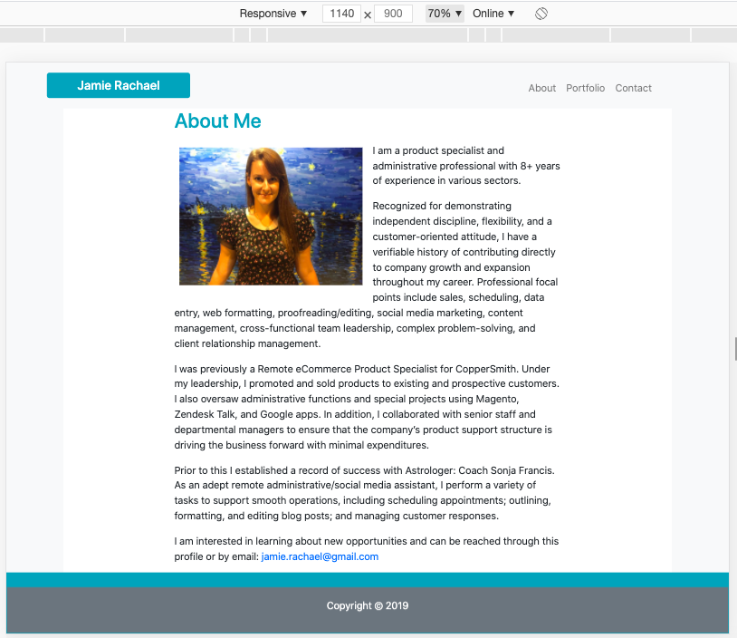
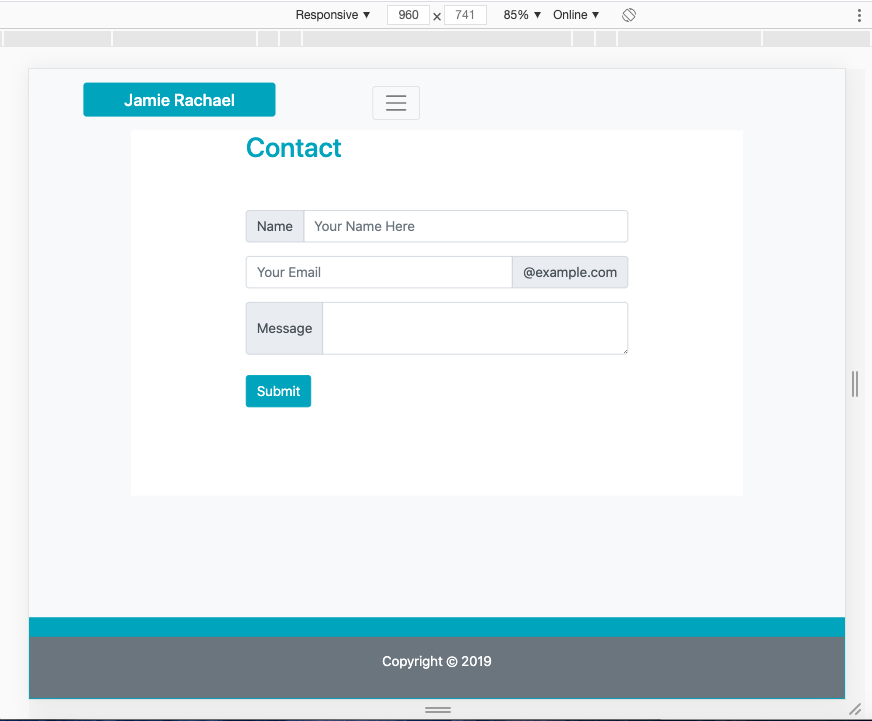
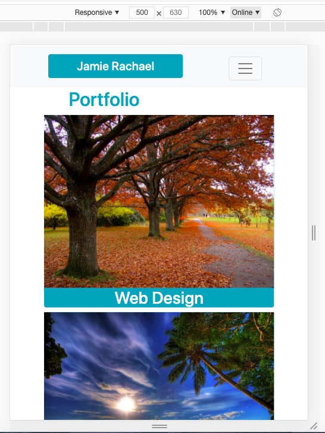

# Bootstrap-Portfolio

* [GitHub Repository](https://github.com/jamierachael/Bootstrap-Portfolio)
* [Deployed GitHub IO](https://jamierachael.github.io/Bootstrap-Portfolio/)
* [Full Demo Video](https://drive.google.com/file/d/1Jq9obaiLVqnFwOI1yDCwhpeddh-4nzgg/view)

### Summary
* Recreation of Portfolio from previous project using Bootstrap only
* This project emphasizes the use of repsonsive design using grid system in Bootstrap

### This project has responsive grids for:
* max container width 1140px
    * Uses col-xl-8 for extra large screens

    
* max container width 960px 
    * Uses col-lg-8 for large screens
    * Resizes img on portfolio page and their associated headings
    * Please note: the headings here become two lines if the heading has two separate words

    
* max container width 720px
    * Uses col-md-8 for medium screens
    * Changes photos and labels to single line

    
 * max container width 540px
    * Uses col-sm-10 for small screens
    * Changes photos and labels to single line
    * Resizes Header

    
* max container width less than 540px
    * Uses col-10 for x-small screens
    * Changes photos and labels to single line
    * Resizes Header

    

### To Execute File:
> Open in browser

### Features: 
* Three HTML Pages
    * Index.html
        * contains personal bio
    * Portfolio.html 
        * contains work examples with headings highlighting services offered
    * Contact.html
        * Contains a customer interest contact form

### Code Validation 
    * These use W3C Code Validators for HTML
    * Please provide feedback whether this image syntax is correct
        * Format: 
        * Format: 
        * Format: 

