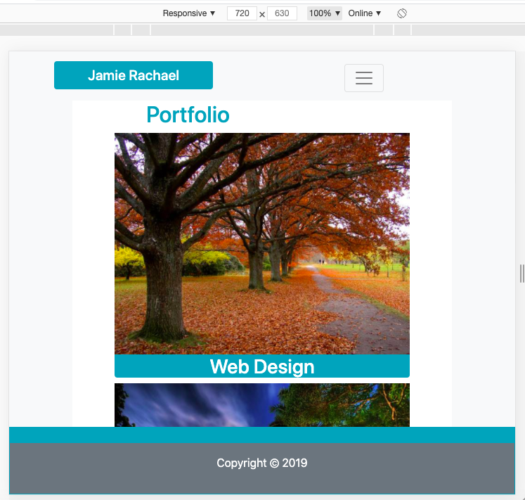

# Bootstrap-Portfolio

This project was designed as a homework assignment for UNH's coding bootcamp. This emphasizes the use of Bootstraps grid design to achieve responsiveness for various screensizes and mobile devices.  

Layout and content were built using HTML and Bootstrap CSS using Visual Studio Code editor. An independent style sheet was purposefully omitted. 

This project has been deployed to GitHub Pages. To get this project up and running, you can follow the deployment link. Or, download the sources files to use this as a template.

* [GitHub Repository](https://github.com/jamierachael/Bootstrap-Portfolio)
* [Deployed GitHub IO](https://jamierachael.github.io/Bootstrap-Portfolio/)
* [Full Demo Video](https://drive.google.com/file/d/1Jq9obaiLVqnFwOI1yDCwhpeddh-4nzgg/view)

### Prerequisites

To install this application, you will need a text editor. I recommend Visual Studio Code. 

### Installing

To install this code, download the zip file, or use GitHub's guidelines to clone the repository. 

## Project Requirements 

This project provides a responsive template for a portfolio website using Bootstrap rows and columns. 

Pages include the following: Index, Portfolio, Contact with Bootstrap grid design for screensizes 1140px, 960px, 720px, 540px, -500px. 

### Summary
* Recreation of Portfolio from previous project using Bootstrap only
* This project emphasizes the use of repsonsive design using grid system in Bootstrap

### This project has responsive grids for:
* max container width 1140px
    * Uses col-xl-8 for extra large screens

    
* max container width 960px 
    * Uses col-lg-8 for large screens
    * Resizes img on portfolio page and their associated headings
    * Please note: the headings here become two lines if the heading has two separate words

    
* max container width 720px
    * Uses col-md-8 for medium screens
    * Changes photos and labels to single line

    
 * max container width 540px
    * Uses col-sm-10 for small screens
    * Changes photos and labels to single line
    * Resizes Header

    
* max container width less than 540px
    * Uses col-10 for x-small screens
    * Changes photos and labels to single line
    * Resizes Header

    

### To Execute File:
> Open in browser

### Features: 
* Three HTML Pages
    * Index.html
        * contains personal bio
    * Portfolio.html 
        * contains work examples with headings highlighting services offered
    * Contact.html
        * Contains a customer interest contact form

## Authors

* **Jamie Rachael Morris** - *Initial work* - [Git Hub Profile](https://github.com/jamierachael)
* UNH Project Design

## Acknowledgments

* Hat tip to UNH for providing project parameters and code examples

